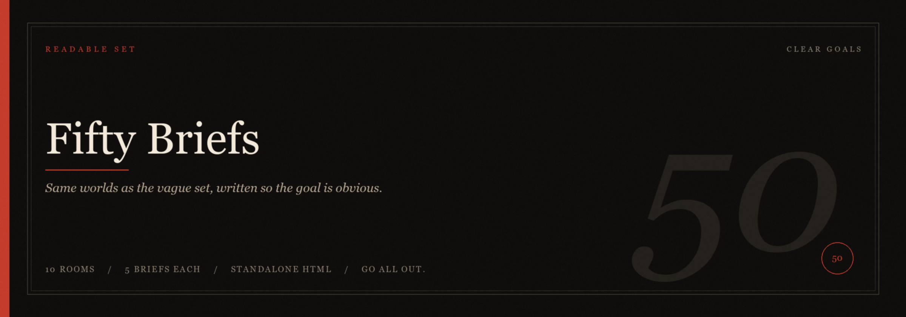

 

**Readable set**

*What it is, a bit more of what is on screen, a named art style, then go all out.*

**11 rooms · 56 briefs · always one file · always Go all out.**

Each brief names the thing, adds enough on-screen detail to aim, and locks an art style.

The spoken twin is [fifty-vague-briefs-hardest-reason.md](fifty-vague-briefs-hardest-reason.md).

<table>
  <tr>
    <td align="center" width="50%"><a href="#01-living-ink"><strong>01</strong> Living Ink</a> Animated SVGs</td>
    <td align="center" width="50%"><a href="#02-glass-worlds"><strong>02</strong> Glass Worlds</a> Three.js</td>
  </tr>
  <tr>
    <td align="center"><a href="#03-tiny-universes"><strong>03</strong> Tiny Universes</a> Pixel art</td>
    <td align="center"><a href="#04-heard-things"><strong>04</strong> Heard Things</a> Music and song</td>
  </tr>
  <tr>
    <td align="center"><a href="#05-the-long-take"><strong>05</strong> The Long Take</a> Games and sims</td>
    <td align="center"><a href="#06-the-boardroom"><strong>06</strong> The Boardroom</a> Financial dashboards</td>
  </tr>
  <tr>
    <td align="center"><a href="#07-time-on-purpose"><strong>07</strong> Time on Purpose</a> Motion graphics</td>
    <td align="center"><a href="#08-math-as-paint"><strong>08</strong> Math as Paint</a> Generative shaders</td>
  </tr>
  <tr>
    <td align="center"><a href="#09-things-that-fall"><strong>09</strong> Things That Fall</a> Physics playgrounds</td>
    <td align="center"><a href="#10-no-ceiling"><strong>10</strong> No Ceiling</a> Unlimited-budget websites</td>
  </tr>
  <tr>
    <td align="center" colspan="2"><a href="#11-hands-off"><strong>11</strong> Hands Off</a> Automatic 3D</td>
  </tr>
</table>

## 01 Living Ink

**Animated SVGs**

A living vector scene. Not a logo spin.

> **01 / 56**
>
> Create a single HTML file of an animated SVG of hot-air balloons lifting at dawn. Balloons actually rise and drift, burners as gold flashes, a valley of mist, layered hills. Art style: 1920s travel poster, cream, terracotta, a strip of gold. Go all out. Use a suitable name for the html file.

> **02 / 56**
>
> Create a single HTML file of an animated SVG hummingbird drinking from a flower. It hovers, then drinks, wings beating fast, pollen and dew in the air, the flower swaying, a paper-shadow under the bird. Art style: 19th century natural-history watercolor on cream paper, fine ink lines, wet color, a small invented latin label in the corner. Go all out. Use a suitable name for the html file.

> **03 / 56**
>
> Create a single HTML file of an animated SVG whale swimming under a moonlit sea. The whale actually moves, light shafts, plankton as gold specks, a moon path on the water. Art style: 19th century maritime painting, deep indigo, bone-white, a gold moon. Go all out. Use a suitable name for the html file.

> **04 / 56**
>
> Create a single HTML file of an animated SVG tiger walking through bamboo. The stalks part, stripes catching light, a slow turn of the head, a few birds as small marks. Art style: Chinese ink and color on silk, gold-green bamboo, the tiger fills the page. Go all out. Use a suitable name for the html file.

> **05 / 56**
>
> Create a single HTML file of an animated SVG campsite at night. A person sitting by the fire playing guitar, animals gathering around, a beautiful night sky. The fire moves, stars, a few notes as gold specks. Art style: storybook night camp, gold fire, navy sky, a ring of animals. Go all out. Use a suitable name for the html file.

## 02 Glass Worlds

**Three.js**

A big 3D simulation. Spectacle, not a quiet room.

> **06 / 56**
>
> Create a single HTML file of a realistic Three.js tornado going through a city and destroying everything. A real funnel, rain, buildings coming apart, cars lifted, debris in the air. The tornado actually moves down the streets. Go all out. Use a suitable name for the html file.

> **07 / 56**
>
> Create a single HTML file of a Three.js military battle between two countries, seen from the eye of god. Two armies on a huge field: tanks, infantry, explosions, smoke, the fight actually moving, not sitting still. You look down from high above and can pan. Go all out. Use a suitable name for the html file.

> **08 / 56**
>
> Create a single HTML file of a Three.js 3D bike riding simulator. You ride, you can steer and speed up, a road through a landscape, the world moving past you. Third person behind the bike. Go all out. Use a suitable name for the html file.

> **09 / 56**
>
> Create a single HTML file of a beautiful, majestic Three.js black hole. A bright accretion disk, gravitational lensing, a photon ring, a dense star field. You can orbit it. It should feel enormous, not a dark swirl. Go all out. Use a suitable name for the html file.

> **10 / 56**
>
> Create a single HTML file of a beautiful Three.js solar system. The sun, planets that look like themselves, Saturn with rings, Earth with clouds, real-feeling orbits, a star field. You can fly around. Go all out. Use a suitable name for the html file.

## 03 Tiny Universes

**Pixel art**

Honest pixels. A scene that keeps living.

> **11 / 56**
>
> Create a single HTML file of a living pixel-art sunset over the ocean with a lighthouse. The sun sinks, the beacon turns, waves loop, gulls, a small boat, maybe a keeper in the tower. 16 to 32 colors, sharp integer pixels, no blur. Go all out. Use a suitable name for the html file.

> **12 / 56**
>
> Create a single HTML file of a living pixel-art snow town at night. Falling snow, warm windows, footprints, a shop still open, chimney smoke. 16 to 32 colors, sharp integer pixels, no blur. Go all out. Use a suitable name for the html file.

> **13 / 56**
>
> Create a single HTML file of a living pixel-art desert mesa at dusk. Wind in the sand, a canyon, a small train in the distance, stars coming out, a lizard or two. 16 to 32 colors, sharp integer pixels, no blur. Go all out. Use a suitable name for the html file.

> **14 / 56**
>
> Create a single HTML file of a living pixel-art view from a spaceship window. Stars, a planet sliding by, a little phosphor HUD, a floating mug, someone walking past inside. 16 to 32 colors, sharp integer pixels, no blur. Go all out. Use a suitable name for the html file.

> **15 / 56**
>
> Create a single HTML file of a living pixel-art jungle waterfall. Water actually falling, mist, birds, ferns moving. 16 to 32 colors, sharp integer pixels, no blur. Go all out. Use a suitable name for the html file.

## 04 Heard Things

**Music and song**

Original looping music in the page, 60 seconds, with a real player.

> **16 / 56**
>
> Create a single HTML file that plays a 60 second original looping song with a late-night car-radio scene as the player. First person, dashboard, a radio, headlights, rain on the windshield, a straight wet highway moving under you. Seamless loop, a real arrangement that changes over the minute (melody, drums, bass), a song that belongs on a night radio, not a 4-bar pad. Art style: late-night highway from the driver's seat, wet asphalt, dark cabin, radio glow. Go all out. Use a suitable name for the html file.

> **17 / 56**
>
> Create a single HTML file that plays a 60 second original looping song inside a living pixel-art night city. Neon signs, a train, rain, windows lit, the whole scene moving with the beat. Seamless loop, a real arrangement that changes over the minute (melody, drums, bass), not a 4-bar pad. Art style: 16-bit SNES, VA-11 Hall-A / night-city pixel, magenta and teal, 16 to 32 colors, sharp integer pixels, no blur. Go all out. Use a suitable name for the html file.

> **18 / 56**
>
> Create a single HTML file that plays a 60 second original looping song in a room at night. A table by the window, a laptop on the table as the player, stars outside. Seamless loop, a real arrangement that changes over the minute (melody, drums, bass), not a 4-bar pad. Art style: quiet night room, window, starlight, the laptop glow. Go all out. Use a suitable name for the html file.

> **19 / 56**
>
> Create a single HTML file that plays a 60 second original looping song with a 2010s music-player scene as the player. A phone or speaker, now-playing, a waveform or EQ that actually follows the music. Seamless loop, a real arrangement that changes over the minute (melody, drums, bass), a 2010s track (indie, R&B, or pop-electronic), not a 4-bar pad. Art style: 2010s now-playing, glass, dark room, album glow. Go all out. Use a suitable name for the html file.

> **20 / 56**
>
> Create a single HTML file that plays a 60 second original looping song in an open field at sunset. Grass moving, a wide sky going gold, a portable speaker on a blanket as the player. Seamless loop, a real arrangement that changes over the minute (melody, drums, bass), not a 4-bar pad. Art style: open field, sunset sky, gold and pink, wind in the grass. Go all out. Use a suitable name for the html file.

## 05 The Long Take

**Games and sims**

Playable. Not a slideshow.

> **21 / 56**
>
> Create a single HTML file of a Geometry Dash clone. 2D, not 3D. A cube, tap or click to jump, spikes and gaps, the course scrolling, a fail that stings, try again. Make it actually fun to play. Go all out. Use a suitable name for the html file.

> **22 / 56**
>
> Create a single HTML file that recreates the match three puzzle format but wraps it in a full RPG progression system where each level represents a battle against a fantasy creature. Matching sword gems should charge an attack meter, while heart gems restore health and shield gems build defense. The board itself should sit in a 3D arena where a hero character faces off against animated monsters that react to your moves. Combos should trigger special attacks with particle effects, and boss encounters should introduce board obstacles like locked tiles and poison clouds that require strategic clearing rather than simple pattern matching. Go all out. Use a suitable name for the html file.

> **23 / 56**
>
> Create a single HTML file of a realistic 3D gun-shooting simulation on a firing range. Switch weapons and actually fire them so you can see what each one does: .50 cal (heavy recoil, long tracer, punch through steel), tank-piercing round (goes through a tank hull dummy), homing launcher (lock on, missile tracks), Kriss Vector (fast SMG, brass, muzzle), shotgun (pellet spread, close punch). Muzzle flash, recoil, impacts, smoke, sound. Art style: photoreal, documentary range, no cartoon guns. A sim of the effects, not a sticker of a gun. Go all out. Use a suitable name for the html file.

> **24 / 56**
>
> Create a single HTML file of Flappy Bird, 1:1, 2D. Tap to flap, pipes, a score, restart on hit. Same look, same feel as the original. Go all out. Use a suitable name for the html file.

> **25 / 56**
>
> Create a single HTML file of a 3D racing game like CSR Racing 2. Playable race, a glossy supercar, nitro, a shift, a night-city strip or drag strip, an opponent. Invent the cars, no real brand logos. Art style: CSR Racing 2, photoreal paint, neon city, wet asphalt, cinematic camera. Make it actually fun to play. Go all out. Use a suitable name for the html file.

## 06 The Boardroom

**Financial dashboards**

Dense and specific. Not three charts and a navy header.

> **26 / 56**
>
> Create a single HTML file of a Bloomberg-style trading terminal. Eight or more panels: live-feeling tickers, a watchlist, a chart, a news strip, maybe bonds, a small map, timestamps. Invent the data. Art style: real Bloomberg, black, amber and orange type, dense, no fintech gradients. Go all out. Use a suitable name for the html file.

> **27 / 56**
>
> Create a single HTML file of a Tesla-style investor dashboard. Deliveries vs plan, energy, a map, a stock-like chart, one huge number, a simple car silhouette. Invent the quarter. Art style: Tesla.com / car UI, white space, red accent, huge numbers, almost no chrome. Go all out. Use a suitable name for the html file.

> **28 / 56**
>
> Create a single HTML file of a live crypto trading dashboard. BTC plus a few alts, candles, an order book twitching, a heat map. Fake but dense. Art style: TradingView night mode, dark, green and red candles, neon ticks. It should feel like it is moving. Go all out. Use a suitable name for the html file.

> **29 / 56**
>
> Create a single HTML file of a luxury hotel revenue dashboard. Occupancy by room type, ADR, restaurants, a calendar, tonight's arrivals. Invent the property. Art style: Aman / quiet paper, sand and stone, small serif type, no neon. Go all out. Use a suitable name for the html file.

> **30 / 56**
>
> Create a single HTML file of a SpaceX-style launch control dashboard. T-minus countdown, fuel, telemetry, a trajectory map, four camera tiles that are graphic (not video files). Art style: mission control, huge screens, blue-gray, countdown grotesk, invented (no NASA or SpaceX logos). Go all out. Use a suitable name for the html file.

## 07 Time on Purpose

**Motion graphics**

A timed film that plays itself.

> **31 / 56**
>
> Create a single HTML file of a 25 second Apple-style product launch film. It plays itself. Invent a small object, light travels across it, type, a one-word name at the end. Art style: Apple keynote, black void, one object, slow light, tight sans. Replay. Go all out. Use a suitable name for the html file.

> **32 / 56**
>
> Create a single HTML file of a Netflix-style title sequence for a made-up show, about 20 seconds. It plays itself. Invent the title. Glimpses of a city or a room, then a last card with the name. Art style: True Detective season 1 titles, film grain, double exposure, slow type. Replay. Go all out. Use a suitable name for the html file.

> **33 / 56**
>
> Create a single HTML file of a 20 second film-studio opening ident. It plays itself. Invent the studio. Fragments or comic pages flip and assemble, then a mark that slams and a short sting. Art style: Marvel Studios intro, gold, panels, one invented mark. Do not copy a real logo. Replay. Go all out. Use a suitable name for the html file.

> **34 / 56**
>
> Create a single HTML file of a 20 second supercar commercial. It plays itself. Use real supercar photos from the web, do not invent or draw the car. Wet coast road, light on metal, a badge and a name at the end. Art style: Ridley Scott car film, wet asphalt, gold hour, slow. Replay. Go all out. Use a suitable name for the html file.

> **35 / 56**
>
> Create a single HTML file of a 20 second movie trailer title sequence. It plays itself. Invent the film title. Four or five cards, sparse frames, a rumble, then the title. Art style: A24 / Nolan, IMAX-scale type, loud cuts. Replay. Go all out. Use a suitable name for the html file.

## 08 Math as Paint

**Generative shaders**

Fullscreen computed picture. Not a CSS gradient.

> **36 / 56**
>
> Create a single HTML file of a fullscreen aurora borealis shader. Slow curtains of light, a dark ridge of mountains, real-looking stars, the mouse can lean it. Art style: Iceland winter photograph, cold green and magenta, not a rainbow screensaver. Go all out. Use a suitable name for the html file.

> **37 / 56**
>
> Create a single HTML file of a fullscreen ocean wave shader. Long swell, foam at the lip, a horizon, maybe a low sun, mouse can tilt the light. Art style: photoreal midday Pacific, Gerstner-like water, not cartoon waves. You should want to stare at it. Go all out. Use a suitable name for the html file.

> **38 / 56**
>
> Create a single HTML file of a fullscreen galaxy shader you can fly through. A bright core, dust lanes, depth, you drift, drag or mouse to move, almost no UI. Art style: Hubble deep field, slow drift, real color, no clipart stars. Go all out. Use a suitable name for the html file.

> **39 / 56**
>
> Create a single HTML file of a fullscreen fire shader. Close crop, logs, heat shimmer, embers, it should feel hot. Art style: close-up campfire photograph, real logs, not a cartoon flame. Go all out. Use a suitable name for the html file.

> **40 / 56**
>
> Create a single HTML file of a fullscreen rain on glass shader. Drops that race, streaks, a neon street smear behind, a city that is only color. Art style: Chungking Express, neon smeared on wet night glass. Go all out. Use a suitable name for the html file.

## 09 Things That Fall

**Physics playgrounds**

Real gravity. Things collide.

> **41 / 56**
>
> Create a single HTML file of a wrecking ball demolishing a 3-story brick building, with real physics. A crane, you swing it, the building comes apart, a dust cloud, debris stays. Art style: dusty daylight construction site, documentary, gray and rust. Go all out. Use a suitable name for the html file.

> **42 / 56**
>
> Create a single HTML file of a Jenga game with real physics. A tall wood tower, pull or drag a block, the tower can fall, restart. Art style: studio product shot on an oak table, real wood grain, late light. Go all out. Use a suitable name for the html file.

> **43 / 56**
>
> Create a single HTML file of a bowling game with real physics. Aim, throw with power, 10 pins, a gutter, a simple frame score. Art style: 1980s American alley, rented-shoe lighting, beer-ad neon, polished wood. The throw should feel good. Go all out. Use a suitable name for the html file.

> **44 / 56**
>
> Create a single HTML file of a pinball game with real physics. One table, invented theme, plunger, flippers, bumpers, a drain, a score. Art style: 1990s arcade cabinet, chrome, neon, worn paint. Make it actually fun to play. Go all out. Use a suitable name for the html file.

> **45 / 56**
>
> Create a single HTML file of a marble run with real physics. A tall wooden machine, drop one marble or many, tracks, a bell or a catch at the bottom, restart. Art style: wooden Grimm's toy, natural wood, kids'-museum light. Pretty and replayable. Go all out. Use a suitable name for the html file.

## 10 No Ceiling

**Unlimited-budget websites**

A production website. Unlimited budget. All-out animations, effects, transitions. Photography or 3D, working UI.

> **46 / 56**
>
> Create a single HTML file of a luxury hotel website that feels like a real production. Use real resort photos from the web. Scroll-driven cinema (pinned hero, sound, page transitions), three rooms you can actually enter, a spa, a working booking flow (dates, room, confirmation). Art style: Aman, full-bleed, lots of air, quiet serif. Unlimited budget. All-out animations, effects, transitions. No limits. Go all out. Use a suitable name for the html file.

> **47 / 56**
>
> Create a single HTML file of a luxury real-estate website that feels like a real production. Use real interior and exterior photos from the web. A cinematic penthouse hero, a 3D apartment you can look around, four listings you can open (price, rooms, a plan), a working inquire or viewing. Art style: Sotheby's Realty / The Agency, full-bleed, quiet serif, city light. Unlimited budget. All-out animations, effects, transitions. No limits. Go all out. Use a suitable name for the html file.

> **48 / 56**
>
> Create a single HTML file of a private jet company website. Use real aircraft and cabin photos from the web, plus a 3D cabin you can look around. A quiet landing, one aircraft, three destinations with a route you can follow, a working membership inquiry. Art style: VistaJet, sky, thin type, cold luxury. Unlimited budget. All-out animations, effects, transitions. No limits. Go all out. Use a suitable name for the html file.

> **49 / 56**
>
> Create a single HTML file of a 3-Michelin-star restaurant website. Use real food photos from the web. A seasonal tasting of 6 to 8 dishes as a scroll film (each course a full-bleed act), a chef's note, a working reservation (date, time, party, confirmation). Art style: Noma / Eleven Madison Park, natural light, one ingredient as hero, lots of white. Unlimited budget. All-out animations, effects, transitions. No limits. Go all out. Use a suitable name for the html file.

> **50 / 56**
>
> Create a single HTML file of an anime and manga library website that feels like a real production. Fetch a public anime/manga API (Jikan or AniList) with no API key and no CORS problems, so titles, posters, and synopses load for real. A cinematic hero, a library you can browse, open a title (stills, a synopsis, a trailer or a manga you can page through), a working shelf or continue-watching. Unlimited budget. All-out animations, effects, transitions. No limits. Go all out. Use a suitable name for the html file.

## 11 Hands Off

**Automatic 3D**

Photoreal 3D that runs itself. A solver, a machine, or a ride you can take over.

> **51 / 56**
>
> Create a single HTML file of a photoreal 3D Rubik's cube that scrambles at random then solves itself. Plastic, stickers, studio light, the cube turning for real, a beautiful loop. Art style: product-shot cube, white infinity, sharp plastic. Go all out. Use a suitable name for the html file.

> **52 / 56**
>
> Create a single HTML file of a photoreal 3D chess game that plays itself. Two sides, pieces moving, a capture, it plays to a finish then resets, a loop. Art style: walnut board, studio light. Go all out. Use a suitable name for the html file.

> **53 / 56**
>
> Create a single HTML file of a photoreal 3D Tower of Hanoi that solves itself. Wooden discs, three pegs, studio light, every legal move, then it resets and loops. Art style: product-shot wood, oak and brass pegs, late light. Go all out. Use a suitable name for the html file.

> **54 / 56**
>
> Create a single HTML file of photoreal 3D dart shots that run themselves. Darts fly, they hit the board, a bullseye or a spread, they reset, a loop. Art style: pub dartboard, sisal, warm lamps. Go all out. Use a suitable name for the html file.

> **55 / 56**
>
> Create a single HTML file of a photoreal 3D mechanical watch that explodes into parts then assembles itself. Gears, jewels, a case, studio light, it comes together and ticks, then it opens again, a loop. Art style: product-shot watch, steel and gold, black velvet. Go all out. Use a suitable name for the html file.

> **56 / 56**
>
> Create a single HTML file of a photoreal 3D first-person elevator simulator. It runs itself: wait in the lobby, the doors open, walk in, ride, stop at a floor, doors open, walk out. You can take over if you want (call a floor, walk). Art style: photoreal office tower, brushed metal, warm lobby light. Go all out. Use a suitable name for the html file.

*Fifty Briefs · readable set · 11 rooms · 56 briefs*

*The vague twin is [fifty-vague-briefs-hardest-reason.md](fifty-vague-briefs-hardest-reason.md).*

*One standalone html file. Every ask ends with Go all out.*

