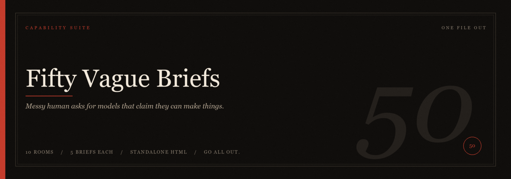

 

**Vague / hardest-reason set**

*Same fifty-six ideas, said like a person. Art style still named.*

**11 rooms · 56 briefs · always one file · always Go all out.**

Same asks as the readable set, just spoken. Use [fifty-briefs-readable.md](fifty-briefs-readable.md) when you want Create.

<table>
  <tr>
    <td align="center" width="50%"><a href="#01-living-ink"><strong>01</strong> Living Ink</a> Animated SVGs</td>
    <td align="center" width="50%"><a href="#02-glass-worlds"><strong>02</strong> Glass Worlds</a> Three.js</td>
  </tr>
  <tr>
    <td align="center"><a href="#03-tiny-universes"><strong>03</strong> Tiny Universes</a> Pixel art</td>
    <td align="center"><a href="#04-heard-things"><strong>04</strong> Heard Things</a> Music and song</td>
  </tr>
  <tr>
    <td align="center"><a href="#05-the-long-take"><strong>05</strong> The Long Take</a> Games and sims</td>
    <td align="center"><a href="#06-the-boardroom"><strong>06</strong> The Boardroom</a> Financial dashboards</td>
  </tr>
  <tr>
    <td align="center"><a href="#07-time-on-purpose"><strong>07</strong> Time on Purpose</a> Motion graphics</td>
    <td align="center"><a href="#08-math-as-paint"><strong>08</strong> Math as Paint</a> Generative shaders</td>
  </tr>
  <tr>
    <td align="center"><a href="#09-things-that-fall"><strong>09</strong> Things That Fall</a> Physics playgrounds</td>
    <td align="center"><a href="#10-no-ceiling"><strong>10</strong> No Ceiling</a> Unlimited-budget websites</td>
  </tr>
  <tr>
    <td align="center" colspan="2"><a href="#11-hands-off"><strong>11</strong> Hands Off</a> Automatic 3D</td>
  </tr>
</table>

## 01 Living Ink

**Animated SVGs**

A living vector scene. Not a logo spin.

> **01 / 56**
>
> I want an animated SVG of hot-air balloons lifting at dawn, one html file. Balloons actually rise and drift, burners as gold flashes, a valley of mist, layered hills. 1920s travel poster: cream, terracotta, a strip of gold. Go all out. Use a suitable name for the html file.

> **02 / 56**
>
> Make me an animated SVG hummingbird at a flower, one html file. It hovers then drinks, wings really beating, pollen, dew, the flower moving, a shadow on the paper. 19th century natural-history watercolor on cream, fine ink, wet color, a tiny invented latin label. Go all out. Use a suitable name for the html file.

> **03 / 56**
>
> Make me an animated SVG whale swimming under a moonlit sea, one html file. The whale actually moves, light shafts, plankton as gold specks, a moon path on the water. 19th century maritime painting: deep indigo, bone-white, a gold moon. Go all out. Use a suitable name for the html file.

> **04 / 56**
>
> Make me an animated SVG tiger walking through bamboo, one html file. Stalks parting, stripes catching light, a slow turn of the head, a few small birds. Chinese ink and color on silk, gold-green bamboo, the tiger fills the page. Go all out. Use a suitable name for the html file.

> **05 / 56**
>
> Make me an animated SVG campsite at night, one html file. A person sitting by the fire playing guitar, animals gathering around, a beautiful night sky. The fire moves, stars, a few notes as gold specks. Storybook night camp: gold fire, navy sky, a ring of animals. Go all out. Use a suitable name for the html file.

## 02 Glass Worlds

**Three.js**

A big 3D simulation. Spectacle, not a quiet room.

> **06 / 56**
>
> Make me a realistic Three.js tornado going through a city and destroying everything, one html file. A real funnel, rain, buildings coming apart, cars lifted, debris. The tornado actually moves down the streets. Go all out. Use a suitable name for the html file.

> **07 / 56**
>
> Make me a Three.js military battle between two countries, one html file. I watch it like the eye of god. Two armies on a huge field: tanks, infantry, explosions, smoke, the fight actually moving, not sitting still. I look down from high above and can pan. Go all out. Use a suitable name for the html file.

> **08 / 56**
>
> Make me a Three.js 3D bike riding simulator, one html file. I ride, I can steer and speed up, a road through a landscape, the world moving past me. Third person behind the bike. Go all out. Use a suitable name for the html file.

> **09 / 56**
>
> Make me a beautiful, majestic Three.js black hole, one html file. Bright accretion disk, gravitational lensing, a photon ring, a dense star field. I can orbit it. It should feel enormous, not a dark swirl. Go all out. Use a suitable name for the html file.

> **10 / 56**
>
> Make me a beautiful Three.js solar system, one html file. The sun, planets that look like themselves, Saturn with rings, Earth with clouds, real-feeling orbits, a star field. I can fly around. Go all out. Use a suitable name for the html file.

## 03 Tiny Universes

**Pixel art**

Honest pixels. A scene that keeps living.

> **11 / 56**
>
> Make me a living pixel-art sunset over the ocean with a lighthouse, one html file. Sun going down, beacon, waves, gulls, a small boat, maybe a keeper. 16 to 32 colors, sharp pixels, no blur. Go all out. Use a suitable name for the html file.

> **12 / 56**
>
> Make me a living pixel-art snow town at night, one html file. Falling snow, warm windows, footprints, a shop still open, chimney smoke. 16 to 32 colors, sharp pixels, no blur. Go all out. Use a suitable name for the html file.

> **13 / 56**
>
> Make me a living pixel-art desert mesa at dusk, one html file. Wind in the sand, a canyon, a small train in the distance, stars coming out, a lizard or two. 16 to 32 colors, sharp pixels, no blur. Go all out. Use a suitable name for the html file.

> **14 / 56**
>
> Make me a living pixel-art view out of a spaceship window, one html file. Stars, a planet drifting, a small HUD, a floating mug, someone walking past. 16 to 32 colors, sharp pixels, no blur. Go all out. Use a suitable name for the html file.

> **15 / 56**
>
> Make me a living pixel-art jungle waterfall, one html file. Water actually falling, mist, birds, ferns moving. 16 to 32 colors, sharp pixels, no blur. Go all out. Use a suitable name for the html file.

## 04 Heard Things

**Music and song**

Original looping music in the page, 60 seconds, with a real player.

> **16 / 56**
>
> Make me a 60 second original looping song with a late-night car-radio scene as the player, one html file. First person, dashboard, a radio, headlights, rain on the windshield, a straight wet highway moving under you. Seamless loop, a real arrangement that changes over the minute (melody, drums, bass), a song that belongs on a night radio, not a 4-bar pad. Late-night highway from the driver's seat: wet asphalt, dark cabin, radio glow. Go all out. Use a suitable name for the html file.

> **17 / 56**
>
> Make me a 60 second original looping song inside a living pixel-art night city, one html file. Neon signs, a train, rain, windows lit, the scene moving with the beat. Seamless loop, a real arrangement that changes over the minute (melody, drums, bass), not a 4-bar pad. 16-bit SNES, VA-11 Hall-A / night-city pixel, magenta and teal, 16 to 32 colors, sharp pixels, no blur. Go all out. Use a suitable name for the html file.

> **18 / 56**
>
> Make me a 60 second original looping song in a room at night, one html file. A table by the window, a laptop on the table as the player, stars outside. Seamless loop, a real arrangement that changes over the minute (melody, drums, bass), not a 4-bar pad. Quiet night room: window, starlight, the laptop glow. Go all out. Use a suitable name for the html file.

> **19 / 56**
>
> Make me a 60 second original looping song with a 2010s music-player scene as the player, one html file. A phone or speaker, now-playing, a waveform or EQ that actually follows the music. Seamless loop, a real arrangement that changes over the minute (melody, drums, bass), a 2010s track (indie, R&B, or pop-electronic), not a 4-bar pad. 2010s now-playing: glass, dark room, album glow. Go all out. Use a suitable name for the html file.

> **20 / 56**
>
> Make me a 60 second original looping song in an open field at sunset, one html file. Grass moving, a wide sky going gold, a portable speaker on a blanket as the player. Seamless loop, a real arrangement that changes over the minute (melody, drums, bass), not a 4-bar pad. Open field, sunset sky: gold and pink, wind in the grass. Go all out. Use a suitable name for the html file.

## 05 The Long Take

**Games and sims**

Playable. Not a slideshow.

> **21 / 56**
>
> Make me a Geometry Dash clone, one html file. 2D, not 3D. A cube, tap or click to jump, spikes and gaps, the course scrolling, a fail that stings, try again. It has to be fun. Go all out. Use a suitable name for the html file.

> **22 / 56**
>
> Make me a match three puzzle wrapped in a full RPG progression system, one html file. Each level is a battle against a fantasy creature. Sword gems charge an attack meter, heart gems restore health, shield gems build defense. The board sits in a 3D arena where a hero faces animated monsters that react to my moves. Combos trigger special attacks with particle effects. Boss fights add locked tiles and poison clouds that I have to clear with strategy, not just pattern matching. Go all out. Use a suitable name for the html file.

> **23 / 56**
>
> Make me a realistic 3D gun-shooting simulation on a firing range, one html file. Let me switch weapons and actually fire them so I can see what each one does: .50 cal (heavy recoil, long tracer, punch through steel), tank-piercing round (goes through a tank hull dummy), homing launcher (lock on, missile tracks), Kriss Vector (fast SMG, brass, muzzle), shotgun (pellet spread, close punch). Muzzle flash, recoil, impacts, smoke, sound. Photoreal, documentary range, no cartoon guns. A sim of the effects, not a sticker of a gun. Go all out. Use a suitable name for the html file.

> **24 / 56**
>
> Make me Flappy Bird, 1:1, 2D, one html file. Tap to flap, pipes, a score, restart on hit. Same look, same feel as the original. Go all out. Use a suitable name for the html file.

> **25 / 56**
>
> Make me a 3D racing game like CSR Racing 2, one html file. Playable race, a glossy supercar, nitro, a shift, a night-city strip or drag strip, an opponent. Invent the cars, no real brand logos. CSR Racing 2 look: photoreal paint, neon city, wet asphalt, cinematic camera. It has to be fun. Go all out. Use a suitable name for the html file.

## 06 The Boardroom

**Financial dashboards**

Dense and specific. Not three charts and a navy header.

> **26 / 56**
>
> Make me a Bloomberg-style trading terminal, one html file. Eight or more panels: twitching tickers, watchlist, chart, news, maybe bonds, a small map, timestamps. Invent the numbers. Real Bloomberg look: black, amber and orange, dense, no startup gradients. Go all out. Use a suitable name for the html file.

> **27 / 56**
>
> Make me a Tesla-style investor dashboard, one html file. Deliveries vs plan, energy, a map, a stock chart, one huge number, a simple car shape. Invent the quarter. Tesla.com / car UI: white space, red accent, huge numbers. Go all out. Use a suitable name for the html file.

> **28 / 56**
>
> Make me a live crypto trading dashboard, one html file. BTC and a few alts, candles, twitching order book, heat map. Fake but dense. TradingView night: dark, green and red candles, neon ticks. It has to feel live. Go all out. Use a suitable name for the html file.

> **29 / 56**
>
> Make me a luxury hotel revenue dashboard, one html file. Occupancy by room type, ADR, restaurants, calendar, tonight's arrivals. Invent the hotel. Aman / quiet paper: sand, stone, small serif, no neon. Go all out. Use a suitable name for the html file.

> **30 / 56**
>
> Make me a SpaceX-style launch control dashboard, one html file. T-minus, fuel, telemetry, trajectory, four graphic camera tiles (not video files). Mission control: huge screens, blue-gray, countdown type. Invented, no real logos. Go all out. Use a suitable name for the html file.

## 07 Time on Purpose

**Motion graphics**

A timed film that plays itself.

> **31 / 56**
>
> Make me a 25 second Apple-style product launch film, one html file. It plays on its own. Invent a small object, light across it, type, a one-word name. Apple keynote: black void, one object, slow light, tight sans. Replay. Go all out. Use a suitable name for the html file.

> **32 / 56**
>
> Make me a Netflix-style title sequence for a show that does not exist, about 20 seconds, one html file. Invent the title. Glimpses of a city or a room, then a last card. True Detective season 1 titles: grain, double exposure, slow type. It plays itself. Replay. Go all out. Use a suitable name for the html file.

> **33 / 56**
>
> Make me a 20 second film-studio opening ident, one html file. It plays itself. Invent the studio. Fragments or comic pages flip and assemble, then a mark that slams and a short sting. Marvel Studios intro: gold, panels, one invented mark. Do not copy a real logo. Go all out. Use a suitable name for the html file.

> **34 / 56**
>
> Make me a 20 second supercar commercial, one html file. It plays itself. Use real supercar photos from the web, do not invent or draw the car. Wet coast road, light on metal, a badge and a name at the end. Ridley Scott car film: wet asphalt, gold hour, slow. Go all out. Use a suitable name for the html file.

> **35 / 56**
>
> Make me a 20 second movie trailer title sequence, one html file. It plays itself. Invent the film title. Four or five cards, a rumble, then the title. A24 / Nolan: huge type, sparse frames, loud cuts. Go all out. Use a suitable name for the html file.

## 08 Math as Paint

**Generative shaders**

Fullscreen computed picture. Not a CSS gradient.

> **36 / 56**
>
> Make me a fullscreen aurora shader, one html file. Slow light curtains, a dark mountain ridge, real-looking stars, mouse leans it. Iceland winter photo: cold green and magenta, not a 90s screensaver. Go all out. Use a suitable name for the html file.

> **37 / 56**
>
> Make me a fullscreen ocean wave shader, one html file. Long swell, foam at the lip, a horizon, maybe a low sun, mouse tilts the light. Photoreal midday Pacific, not cartoon water. I want to just watch it. Go all out. Use a suitable name for the html file.

> **38 / 56**
>
> Make me a fullscreen galaxy shader I can fly through, one html file. A bright core, dust lanes, depth, I drift, let me drag, almost no UI. Hubble deep field: slow, real color, no clipart stars. Go all out. Use a suitable name for the html file.

> **39 / 56**
>
> Make me a fullscreen fire shader, one html file. Close crop, logs, heat shimmer, embers, I want it to feel hot. Close-up campfire photo, real logs, not cartoon fire. Go all out. Use a suitable name for the html file.

> **40 / 56**
>
> Make me a fullscreen rain on glass shader, one html file. Drops that race, streaks, a neon street smear behind, a city that is only color. Chungking Express: neon smeared on wet night glass. Go all out. Use a suitable name for the html file.

## 09 Things That Fall

**Physics playgrounds**

Real gravity. Things collide.

> **41 / 56**
>
> Make me a wrecking ball knocking down a 3-story brick building, real physics, one html file. A crane, I swing it, it comes apart, dust, the mess stays. Dusty daylight construction site, documentary, gray and rust. Go all out. Use a suitable name for the html file.

> **42 / 56**
>
> Make me a Jenga game with real physics, one html file. Tall wood tower, pull a block, it can fall, restart. Studio product shot on oak, real wood grain, late light. Go all out. Use a suitable name for the html file.

> **43 / 56**
>
> Make me a bowling game with real physics, one html file. Aim, throw with power, 10 pins, a gutter, a simple score. 1980s American alley: rented-shoe light, beer-ad neon, polished wood. Make the throw feel good. Go all out. Use a suitable name for the html file.

> **44 / 56**
>
> Make me a pinball game with real physics, one html file. One table, invented theme, plunger, flippers, bumpers, a drain, a score. 1990s arcade cabinet: chrome, neon, worn paint. It has to be fun. Go all out. Use a suitable name for the html file.

> **45 / 56**
>
> Make me a marble run with real physics, one html file. A tall wooden machine, drop one or many, tracks, a bell or a catch at the bottom, restart. Wooden Grimm's toy, natural wood, museum light. Pretty, I want to replay it. Go all out. Use a suitable name for the html file.

## 10 No Ceiling

**Unlimited-budget websites**

A production website. Unlimited budget. All-out animations, effects, transitions. Photography or 3D, working UI.

> **46 / 56**
>
> Make me a luxury hotel website that feels like a real production, one html file. Real resort photos from the web. Scroll cinema (pinned hero, sound, transitions), three rooms I can enter, a spa, a working booking (dates, room, confirmation). Aman: full-bleed, lots of air, quiet serif. Unlimited budget. All-out animations, effects, transitions. No limits. Go all out. Use a suitable name for the html file.

> **47 / 56**
>
> Make me a luxury real-estate website that feels like a real production, one html file. Real interior and exterior photos from the web. Cinematic penthouse hero, a 3D apartment I can look around, four listings I can open (price, rooms, a plan), a working inquire or viewing. Sotheby's Realty / The Agency: full-bleed, quiet serif, city light. Unlimited budget. All-out animations, effects, transitions. No limits. Go all out. Use a suitable name for the html file.

> **48 / 56**
>
> Make me a private jet company website, one html file. Real aircraft and cabin photos from the web, plus a 3D cabin I can look around. Quiet landing, one aircraft, three destinations with a route I can follow, a working membership inquiry. VistaJet: sky, thin type, cold luxury. Unlimited budget. All-out animations, effects, transitions. No limits. Go all out. Use a suitable name for the html file.

> **49 / 56**
>
> Make me a 3-Michelin-star restaurant website, one html file. Real food photos from the web. Seasonal tasting of 6 to 8 dishes as a scroll film, each course a full-bleed act, a chef's note, a working reservation (date, time, party, confirmation). Noma / Eleven Madison: natural light, one ingredient as hero, lots of white. Unlimited budget. All-out animations, effects, transitions. No limits. Go all out. Use a suitable name for the html file.

> **50 / 56**
>
> Make me an anime and manga library website that feels like a real production, one html file. Fetch a public anime/manga API (Jikan or AniList) with no API key and no CORS problems, so titles, posters, and synopses load for real. Cinematic hero, a library I can browse, open a title (stills, a synopsis, a trailer or a manga I can page through), a working shelf or continue-watching. Unlimited budget. All-out animations, effects, transitions. No limits. Go all out. Use a suitable name for the html file.

## 11 Hands Off

**Automatic 3D**

Photoreal 3D that runs itself. A solver, a machine, or a ride you can take over.

> **51 / 56**
>
> Make me a photoreal 3D Rubik's cube that scrambles at random then solves itself, one html file. Plastic, stickers, studio light, the cube turning for real, a beautiful loop. Product-shot cube: white infinity, sharp plastic. Go all out. Use a suitable name for the html file.

> **52 / 56**
>
> Make me a photoreal 3D chess game that plays itself, one html file. Two sides, pieces moving, a capture, it plays to a finish then resets, a loop. Walnut board, studio light. Go all out. Use a suitable name for the html file.

> **53 / 56**
>
> Make me a photoreal 3D Tower of Hanoi that solves itself, one html file. Wooden discs, three pegs, studio light, every legal move, then it resets and loops. Product-shot wood: oak and brass pegs, late light. Go all out. Use a suitable name for the html file.

> **54 / 56**
>
> Make me photoreal 3D dart shots that run themselves, one html file. Darts fly, they hit the board, a bullseye or a spread, they reset, a loop. Pub dartboard: sisal, warm lamps. Go all out. Use a suitable name for the html file.

> **55 / 56**
>
> Make me a photoreal 3D mechanical watch that explodes into parts then assembles itself, one html file. Gears, jewels, a case, studio light, it comes together and ticks, then it opens again, a loop. Product-shot watch: steel and gold, black velvet. Go all out. Use a suitable name for the html file.

> **56 / 56**
>
> Make me a photoreal 3D first-person elevator simulator, one html file. It runs itself: wait in the lobby, the doors open, walk in, ride, stop at a floor, doors open, walk out. I can take over if I want (call a floor, walk). Photoreal office tower: brushed metal, warm lobby light. Go all out. Use a suitable name for the html file.

*Fifty Vague Briefs · 11 rooms · 56 briefs*

*One standalone html file.*

